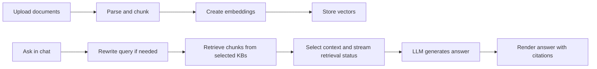
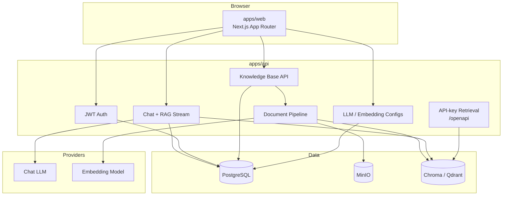

# Knowledge Base & Chat

<div align="center">
  <p><strong>Self-hosted RAG knowledge base Q&A with citations, retrieval progress, and configurable models.</strong></p>
  <p>
    <a href="LICENSE">Apache License 2.0</a>
    · <strong>English</strong> | <a href="README.zh-CN.md">简体中文</a>
  </p>
</div>

## What This Is

This repository is a self-hostable RAG web application. Users create knowledge bases, upload documents, ask questions in chat, and verify answers through citations and retrieval status.

It is a pnpm + Turborepo monorepo:

- `apps/web`: Next.js App Router dashboard, chat UI, i18n, model settings, knowledge-base management.
- `apps/api`: FastAPI, SQLAlchemy, Alembic, document ingestion, vector retrieval, chat streaming.
- PostgreSQL stores metadata.
- MinIO stores uploaded files.
- Chroma or Qdrant stores vectors.
- LLM and embedding providers are configurable through environment variables and the dashboard.

## Product Features

- Knowledge-base CRUD with icons/colors.
- Upload PDF, DOCX, Markdown, and text files.
- Preview chunks before processing.
- Background document parsing, chunking, embedding, retry, and reprocess.
- Multi-knowledge-base chat.
- Streaming assistant responses.
- Retrieval status panel: query rewrite, search, recall, selection, and generation.
- Citations with source snippets.
- User-level LLM and embedding configurations.
- API keys for server-to-server retrieval.
- English and Chinese UI.

## How RAG Works



## Architecture



## Main Routes

Frontend routes include the locale prefix, for example `/en/dashboard/chat` or `/zh/dashboard/chat`.

| Area | Frontend path |
|---|---|
| Dashboard | `/dashboard` |
| Knowledge bases | `/dashboard/knowledge` |
| Knowledge-base detail | `/dashboard/knowledge/:kb_uuid` |
| Chat | `/dashboard/chat` |
| Chat conversation | `/dashboard/chat/:chat_uuid` |
| RAG flow | `/dashboard/rag` |
| LLM configs | `/dashboard/llm-configs` |
| Embedding configs | `/dashboard/embedding-configs` |
| API keys | `/dashboard/api-keys` |
| Account | `/dashboard/account` |

Backend routes are mounted under `/api`, not `/api/v1`.

| Area | Backend path |
|---|---|
| OpenAPI schema | `/api/openapi.json` |
| Health | `/api/health` |
| Auth | `/api/auth/*` |
| Knowledge bases | `/api/knowledge-base/*` |
| Chat | `/api/chat/*` |
| LLM configs | `/api/llm-configs/*` |
| Embedding configs | `/api/embedding-configs/*` |
| API keys | `/api/api-keys/*` |
| API-key retrieval | `/openapi/knowledge/:kb_uuid/query` |

## Quick Start With Docker

Requirements: Docker Compose v2+, 8 GB+ RAM recommended.

```bash
git clone <your-repo-url>
cd rag-web-ui
cp .env.example .env
# Edit CHAT_* / EMBEDDINGS_* / SECRET_KEY before production use.
docker compose up -d --build
```

Default local URLs:

| Service | URL |
|---|---|
| Web | http://localhost:3000 |
| API | http://localhost:8000 |
| ReDoc | http://localhost:8000/redoc |
| API schema | http://localhost:8000/api/openapi.json |
| Health | http://localhost:8000/api/health |
| MinIO console | http://localhost:9001 |
| Chroma host port | http://localhost:8001 |

Inside Docker Compose, the API uses `CHROMA_URL=http://chromadb:8000`.

If chat or embeddings use host Ollama from Docker, set:

```env
CHAT_API_BASE=http://host.docker.internal:11434
EMBEDDINGS_API_BASE=http://host.docker.internal:11434
```

## Local Development

Requirements:

| Tool | Version |
|---|---|
| Node.js | 18+ |
| pnpm | 9.x, see `packageManager` in `package.json` |
| Python | 3.11 or 3.12 recommended |
| Docker | Recommended for PostgreSQL and MinIO |

Recommended hybrid setup:

```bash
cp .env.example .env

docker compose up -d db minio

pnpm install
cd apps/api
python3.12 -m venv .venv
.venv/bin/pip install -r requirements.txt
cd ../..

pnpm dev
```

`pnpm dev` starts local Chroma on `127.0.0.1:28100` and runs the web and API apps through Turbo. On macOS, prefer `127.0.0.1` over `localhost` for Chroma to avoid IPv6/IPv4 mismatch issues.

Useful commands:

| Command | Description |
|---|---|
| `pnpm dev` | Start Chroma + web + API |
| `pnpm dev:chroma` | Start Chroma only |
| `pnpm dev:chroma:stop` | Stop local Chroma |
| `pnpm dev:app` | Start web + API only |
| `pnpm build` | Build all packages |
| `pnpm lint` | Lint all packages |
| `pnpm test` | Run tests in watch mode where configured |
| `pnpm test:ci` | Run CI-style tests |
| `pnpm reset-data` | Reset app data, destructive |
| `pnpm reset-data:dry-run` | Preview reset scope |

## Configuration

Copy `.env.example` to `.env` for local development or `.env.production` for deployment.

### Chat Models

Set:

```env
CHAT_PROVIDER=deepseek
CHAT_API_KEY=your-api-key
CHAT_API_BASE=https://api.deepseek.com
CHAT_MODEL=deepseek-v4-flash
```

Supported patterns:

- Native providers: `openai`, `deepseek`, `minimax`, `ollama`.
- OpenAI-compatible providers: `anthropic`, `google`, `qwen`, `kimi`, `mistral`, `azure`, `zhipu`, and others through custom base URLs.
- Dashboard-managed configs are stored per user in PostgreSQL.

### Embeddings

Set:

```env
EMBEDDINGS_PROVIDER=ollama
EMBEDDINGS_API_BASE=http://localhost:11434
EMBEDDINGS_MODEL=bge-m3
```

Supported providers:

- `openai`
- `ollama`
- `dashscope`
- `huggingface`

Changing the embedding model may change vector dimensions. Reprocess documents after switching embedding models.

DeepSeek does not provide embeddings. Use `ollama`, `openai`, `dashscope`, or `huggingface` for embeddings.

### Retrieval Scoring

Retrieval scores are streamed to the frontend when the vector store returns them. Optional filtering can be configured:

```env
RETRIEVAL_SCORE_THRESHOLD=
RETRIEVAL_SCORE_MODE=distance
```

- `distance`: lower score is better.
- `similarity`: higher score is better.
- If no threshold is set, scores are displayed but not filtered.

### Infrastructure

| Variable | Purpose |
|---|---|
| `POSTGRES_*` | Users, chats, knowledge bases, model configs, tasks |
| `MINIO_*` | Uploaded document storage |
| `VECTOR_STORE_TYPE` | `chroma` or `qdrant` |
| `CHROMA_URL` | Chroma HTTP endpoint |
| `QDRANT_URL` | Qdrant endpoint when enabled |
| `SECRET_KEY` | JWT signing key; change in production |
| `WEB_BASE_URL` | Public frontend URL |
| `API_BASE_URL` | Public API URL used by the frontend |
| `CORS_ALLOWED_ORIGINS` | Additional allowed origins |

Legacy provider-specific variables such as `OPENAI_API_KEY`, `DEEPSEEK_*`, and `OLLAMA_*` remain available as fallbacks when unified `CHAT_*` / `EMBEDDINGS_*` variables are empty.

## API Integration

### Browser / SPA

Use JWT auth:

```text
POST /api/auth/token
Authorization: Bearer <token>
```

Main application APIs live under `/api/*`.

### Server-to-server Retrieval

Create an API key in the dashboard, then call:

```text
GET /openapi/knowledge/:kb_uuid/query?query=...&top_k=3
X-API-Key: <your-api-key>
```

Response shape:

```json
{
  "results": [
    {
      "content": "...",
      "metadata": {
        "file_name": "example.pdf",
        "kb_uuid": "01...",
        "document_id": 123
      },
      "score": 0.123
    }
  ]
}
```

## Project Structure

```text
rag-web-ui/
├── apps/
│   ├── api/
│   │   ├── app/api/api_v1/      # Auth, KB, chat, model configs, API keys
│   │   ├── app/api/openapi/     # API-key retrieval
│   │   ├── app/models/          # SQLAlchemy models
│   │   ├── app/services/        # RAG, document processing, providers
│   │   └── alembic/             # DB migrations
│   └── web/
│       ├── src/app/             # Next.js routes
│       ├── src/components/      # UI components
│       ├── src/lib/             # Client utilities and stream parsing
│       └── src/messages/        # en / zh translations
├── docs/
├── scripts/
├── docker-compose.yml
├── docker-compose.prod.yml
├── docker-compose.chroma.yml
├── pnpm-workspace.yaml
└── package.json
```

## Deployment Notes

Use one of:

| Method | Use case |
|---|---|
| `docker compose up -d --build` | Single-machine demo/dev |
| `docker compose -f docker-compose.prod.yml up -d --build` | Production web + API containers |
| `docker compose -f docker-compose.chroma.yml up -d` | Dedicated Chroma process |
| `./deploy.sh` | Rsync to a VPS, run production Compose, run migrations |

Production checklist:

- Set a strong `SECRET_KEY`.
- Set real PostgreSQL and MinIO credentials.
- Configure `WEB_BASE_URL`, `API_BASE_URL`, and `CORS_ALLOWED_ORIGINS`.
- Back up PostgreSQL, MinIO data, and `chroma_data/`.
- Do not rely on local `/tmp` files for durability; processed documents should live in MinIO.

## Further Reading

| File | Topic |
|---|---|
| [docs/ADD_DOCUMENT_FLOW.md](docs/ADD_DOCUMENT_FLOW.md) | Document upload, chunking, and embedding |
| [docs/OLLAMA_EMBEDDINGS.md](docs/OLLAMA_EMBEDDINGS.md) | Ollama embedding setup |
| [docs/HUGGINGFACE_EMBEDDINGS.md](docs/HUGGINGFACE_EMBEDDINGS.md) | HuggingFace embedding setup |
| [docs/troubleshooting.md](docs/troubleshooting.md) | Troubleshooting |
| [docs/tutorial/README.md](docs/tutorial/README.md) | Chinese RAG tutorial |

## License

Maintained as a fork of [rag-web-ui/rag-web-ui](https://github.com/rag-web-ui/rag-web-ui) under [Apache License 2.0](LICENSE).
