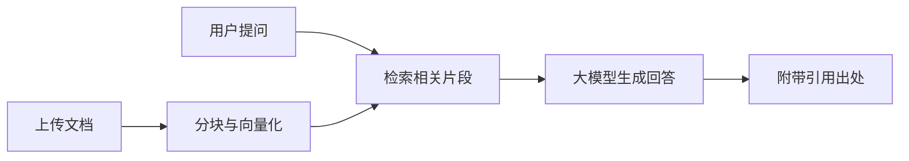

# 智能知识库与对话

<div align="center">
  
  <p><strong>基于 RAG 的企业/个人知识库问答系统</strong></p>
  <p>
    <a href="LICENSE">Apache License 2.0</a>
    · <a href="docs/troubleshooting.md">常见问题与排错</a>
    · <a href="docs/blog/deploy-local.md">本地部署说明</a>
    · <a href="docs/tutorial/README.md">RAG 教程</a>
    · <a href="README.zh-CN.md">详细版说明（含截图与架构图）</a>
  </p>
</div>

## 目录

- [一句话说明](#一句话说明)
- [能做什么](#能做什么)
- [核心能力](#核心能力)
- [给最终用户的使用方式](#给最终用户的使用方式)
- [从提问到回答](#从提问到回答)
- [重要提示](#重要提示)
- [关于本项目与 Fork 来源](#关于本项目与-fork-来源)
- [快速开始](#快速开始)
- [本地开发（pnpm）](#本地开发pnpm)
- [项目结构](#项目结构)
- [技术栈](#技术栈)
- [配置说明](#配置说明)
- [部署与运维](#部署与运维)
- [文档索引](#文档索引)
- [许可证与致谢](#许可证与致谢)

## 一句话说明

用您自己的资料，做更靠谱的问答与助手：上传文档、自然语言提问、回答附带可参考的出处。

## 能做什么

这是一款面向 **普通使用者与团队** 的智能知识库与对话工具。您可以把工作、学习里的 **PDF、Word、Markdown、纯文本** 等资料放进系统，之后在对话里用自然语言提问；系统会 **结合您上传的内容** 生成回答，并在合适时标出 **参考出处**，方便核对原文。

典型用途：

| 场景 | 说明 |
|------|------|
| 资料问答 | 手册、制度、产品说明、笔记整理成可检索知识库 |
| 阅读辅助 | 针对长文档提问，快速定位相关段落 |
| 多轮对话 | 同一会话内连续追问，上下文尽量连贯 |
| 开放集成 | 通过 API Key 与 OpenAPI 对接自有系统 |

无需了解「向量」「RAG」等术语也能使用；技术人员部署好后，用户通常只需 **打开网页、登录、上传、提问**。

## 核心能力

- **知识库管理**：多知识库隔离、文档上传与处理进度、检索测试
- **智能对话**：基于检索增强生成（RAG）、流式回复、回答中的引用角标与原文对照
- **模型配置**：控制台管理对话模型与 Embedding（支持多家云端与 Ollama 本地）
- **多语言界面**：中英文界面（`/zh`、`/en` 路由）
- **API 与密钥**：OpenAPI 检索接口、API Key 管理
- **可扩展存储**：PostgreSQL + MinIO + ChromaDB / Qdrant（向量库可切换）

界面预览见 [README.zh-CN.md](README.zh-CN.md) 中的截图章节。

## 给最终用户的使用方式

1. **打开产品地址** — 由管理员或部署方提供（公司内网或已上线站点）。
2. **登录账号** — 按组织要求注册或使用已有账号。
3. **创建或选择知识库** — 按主题（如「人事制度」「产品文档」）分库管理。
4. **上传文档** — 支持常见办公与文本格式；后台完成解析与入库后再提问效果更好。
5. **开始对话** — 用日常语言提问；若回答引用了资料，请以 **原始文档为准** 核对重要结论（数字、日期、合规类内容尤需如此）。

无法登录、上传失败、回答异常时，请先查看 **[常见问题与排错](docs/troubleshooting.md)**，或联系为您提供服务的一方。

## 从提问到回答



1. 上传的资料被整理成可检索的知识片段并存入向量库。
2. 每次提问时，系统先检索与问题最相关的片段。
3. 再结合大语言模型生成回答，并尽量附上可参考的文档位置。

目的是让回答 **更贴近您自己的资料**，而不是泛泛而谈。

## 重要提示

- **输出仅供参考**：大模型可能产生不准确或不完整的内容；涉及法律、医疗、财务等决策时，请务必人工核实。
- **部署与商用**：自行部署时请评估安全、合规与运维；生产使用前请充分测试与备份。
- **隐私**：请勿提交无权使用的机密或他人隐私；数据留存与出境策略以您所处环境的规定为准。

## 关于本项目与 Fork 来源

本仓库代码 **Fork 自开源项目 [rag-web-ui/rag-web-ui](https://github.com/rag-web-ui/rag-web-ui)**，在遵守 **Apache License 2.0** 的前提下进行维护与定制（含 monorepo 结构调整、PostgreSQL、模型配置界面等）。关注上游通用能力时，可一并查阅原仓库。

在此向原项目作者与社区致谢。

## 快速开始

### 环境要求

| 组件 | 要求 |
|------|------|
| Docker | Docker Compose v2.0+（推荐一键起全栈） |
| Node.js | 18+（仅本地前端开发时需要） |
| pnpm | 8.x（仓库根目录安装依赖） |
| Python | **3.11 或 3.12**（后端；勿用 3.14，当前依赖不兼容） |
| 内存 | 建议 8GB+ |

### Docker Compose（推荐）

```bash
git clone <your-repo-url>
cd rag-web-ui
cp .env.example .env
# 编辑 .env：配置 CHAT_PROVIDER、EMBEDDINGS_PROVIDER、API Key 等
docker compose up -d --build
```

启动后常用地址（默认端口，以 `docker-compose.yml` 为准）：

| 服务 | 地址 |
|------|------|
| 前端 | http://localhost:3000 |
| 后端 API | http://localhost:8000 |
| API 文档（ReDoc） | http://localhost:8000/redoc |
| MinIO 控制台 | http://localhost:9001 |
| Chroma（宿主机映射） | http://localhost:8001 |

使用 **Ollama** 时，请在宿主机安装并拉取对话与向量模型，`.env` 中 `OLLAMA_API_BASE` 在 Compose 内通常为 `http://host.docker.internal:11434`。分步说明见 **[本地部署说明](docs/blog/deploy-local.md)**。

## 本地开发（pnpm）

仓库为 **pnpm workspace + Turborepo**：Next.js 前端在 `apps/web/`，FastAPI 后端在 `apps/api/`。

### 1. 安装依赖

在 **仓库根目录** 执行（勿在 `apps/web` 内单独 `npm install`）：

```bash
pnpm install
```

若曾遇到 `recharts` 安装阶段执行 `husky` 报错，本项目已通过 `patches/recharts@3.8.0.patch` 处理；请始终使用根目录 `pnpm install`。

### 2. 配置环境

```bash
cp .env.example .env
```

开发与生产均会读取 **仓库根目录 `.env`**；也可使用 `apps/api/.env` 覆盖后端项。Next.js 另支持 `.env.local` 等（见 `apps/web/next.config.js`）。

### 3. 启动依赖服务

`pnpm dev` 在宿主机启动 API 时，`apps/api/scripts/dev.sh` 会把 Compose 风格主机名自动映射到本机：

- `POSTGRES_SERVER=db` → `localhost:5432`
- `CHROMA_DB_HOST=chromadb` → `localhost:8001`
- `MINIO_ENDPOINT=minio:9000` → `localhost:9000`

请先启动 Postgres、Chroma、MinIO，例如：

```bash
docker compose up -d db chromadb minio
```

### 4. Python 虚拟环境

```bash
cd apps/api
python3.12 -m venv .venv
.venv/bin/pip install -r requirements.txt
cd ../..
```

### 5. 启动开发服务

```bash
pnpm dev
```

| 命令 | 说明 |
|------|------|
| `pnpm dev` | Turborepo 并行启动前后端 |
| `pnpm build` | 生产构建 |
| `pnpm lint` | 静态检查 |
| `pnpm test` / `pnpm test:ci` | 测试 |

前端默认 http://localhost:3000 ，后端默认 http://localhost:8000 。

## 项目结构

```
rag-web-ui/
├── apps/
│   ├── api/          # FastAPI 后端、Alembic 迁移、业务服务
│   └── web/          # Next.js 前端（i18n、Dashboard）
├── docs/             # 教程、排错、部署博文
├── patches/          # pnpm 依赖补丁
├── docker-compose.yml
├── docker-compose.dev.yml
├── docker-compose.prod.yml
├── Dockerfile.frontend
├── deploy.sh         # 生产 rsync + compose 部署脚本
├── .env.example
└── package.json      # Turborepo 根脚本
```

## 技术栈

| 层级 | 技术 |
|------|------|
| 前端 | Next.js、TypeScript、Tailwind CSS、shadcn/ui |
| 后端 | Python FastAPI、LangChain、SQLAlchemy、Alembic |
| 数据 | PostgreSQL（元数据）、ChromaDB / Qdrant（向量）、MinIO（对象存储） |
| 认证 | JWT |
| 工程 | pnpm workspace、Turborepo、Docker |

## 配置说明

复制 `.env.example` 后，按场景填写。生产环境可参考 `.env.production.example`。

### 对话模型（`CHAT_PROVIDER`）

| 取值 | 说明 |
|------|------|
| `openai` | OpenAI 及兼容 API |
| `deepseek` | DeepSeek |
| `ollama` | 本地 Ollama |
| `minimax` | MiniMax |
| `anthropic` / `google` / `qwen` / `kimi` 等 | OpenAI 兼容协议（需在控制台或环境变量中配置 Key 与 Base URL） |

### 向量模型（`EMBEDDINGS_PROVIDER`）

| 取值 | 说明 |
|------|------|
| `openai` | OpenAI Embedding |
| `ollama` | 本地模型（如 `bge-m3`、`nomic-embed-text`） |
| `huggingface` | HuggingFace 模型，见 [HUGGINGFACE_EMBEDDINGS.md](docs/HUGGINGFACE_EMBEDDINGS.md) |
| `dashscope` | 阿里云 DashScope |

DeepSeek **不提供** Embedding API，请搭配 `ollama`、`openai` 或 `huggingface`。

### 向量库（`VECTOR_STORE_TYPE`）

- `chroma`（默认）：`CHROMA_MODE=http` 时连 Chroma 服务；本地可无 Docker 使用 `persistent` 模式
- `qdrant`：取消 `docker-compose.yml` 中 qdrant 服务注释并配置 `QDRANT_URL`

更多变量说明见根目录 **`.env.example`** 内注释。

## 部署与运维

| 方式 | 说明 |
|------|------|
| `docker compose -f docker-compose.prod.yml` | 生产前后端镜像 |
| `./deploy.sh` | 将代码 rsync 到远程主机并用 prod compose 构建启动（需配置 `REMOTE_HOST`、`REMOTE_DIR`、`.env.production`） |
| `Dockerfile.frontend` | 前端生产镜像（构建上下文为仓库根目录） |

部署前请修改 **`SECRET_KEY`**、数据库密码、MinIO 密钥，并设置 `API_BASE_URL` / `WEB_BASE_URL` / `CORS_ALLOWED_ORIGINS`（见 `.env.production.example`）。

## 文档索引

| 文档 | 内容 |
|------|------|
| [docs/troubleshooting.md](docs/troubleshooting.md) | 安装、数据库、依赖等排错 |
| [docs/blog/deploy-local.md](docs/blog/deploy-local.md) | Ollama + Docker 本地部署 walkthrough |
| [docs/tutorial/README.md](docs/tutorial/README.md) | RAG 全流程教程 |
| [docs/HUGGINGFACE_EMBEDDINGS.md](docs/HUGGINGFACE_EMBEDDINGS.md) | HuggingFace Embedding 配置 |
| [docs/OLLAMA_EMBEDDINGS.md](docs/OLLAMA_EMBEDDINGS.md) | Ollama 向量模型说明 |
| [README.zh-CN.md](README.zh-CN.md) | 更完整的中文说明（特性列表、架构图、配置表） |

## 许可证与致谢

本项目沿用 **[Apache License 2.0](LICENSE)**。

感谢上游 [rag-web-ui/rag-web-ui](https://github.com/rag-web-ui/rag-web-ui) 及 FastAPI、LangChain、Next.js、Chroma、MinIO 等开源生态，使本类产品得以持续演进。
