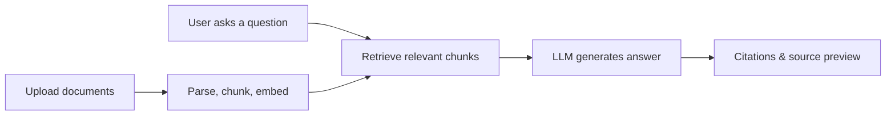
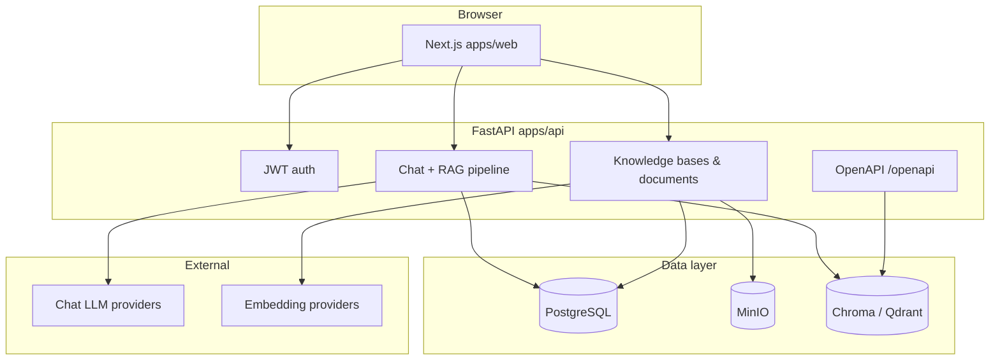

# Knowledge Base & Chat

<div align="center">
  <p><strong>RAG-powered knowledge base Q&A — upload your docs, ask in natural language, answers with citations</strong></p>
  <p>
    <a href="LICENSE">Apache License 2.0</a>
    · <strong>English</strong> | <a href="README.zh-CN.md">简体中文</a>
  </p>
</div>

## Table of contents

**Everyone**

- [At a glance](#at-a-glance)
- [How it works](#how-it-works)

**End users**

- [For end users](#for-end-users)
- [Using the web app](#using-the-web-app)
- [Supported documents](#supported-documents)
- [Tips & limitations](#tips--limitations)

**Developers**

- [For developers](#for-developers)
- [Architecture](#architecture)
- [Quick start (Docker)](#quick-start-docker)
- [Local development](#local-development)
- [Project structure](#project-structure)
- [Configuration](#configuration)
- [API integration](#api-integration)
- [Deployment](#deployment)
- [Further reading](#further-reading)
- [Upstream & license](#upstream--license)

---

## At a glance

| Audience | You get |
|----------|---------|
| **End users** | A web app to upload PDF/Word/Markdown/text, chat against your libraries, see citations and retrieval progress — no ML jargon required |
| **Developers** | A self-hostable monorepo (Next.js + FastAPI), pluggable LLM/embedding providers, Chroma or Qdrant, OpenAPI retrieval, Docker and `pnpm dev` workflows |

---

## How it works



1. Documents are parsed, split into chunks, and stored in a vector database.
2. Each question retrieves the most relevant chunks from selected knowledge bases.
3. A chat model composes the answer; the UI can show **citation markers**, **source snippets**, and a **retrieval status** stream while searching.

---

## For end users

### What you can do

- **Knowledge bases** — Organize content by topic (e.g. HR policies, product manuals).
- **Document Q&A** — Ask in everyday language; answers prefer **your uploaded files**, not the open web.
- **Multi-turn chat** — Follow up in the same conversation; pick one or more knowledge bases per chat.
- **Trust but verify** — Click citation numbers to open source previews when the model references a document.
- **Languages** — Switch UI between English and Chinese (`/en` … or `/zh` … in the URL, or the locale switcher in the header).

### Typical workflows

| Goal | Steps |
|------|--------|
| Build a library | Dashboard → **Knowledge bases** → create → **Upload** → wait until processing finishes |
| Test retrieval | Open a knowledge base → **Test retrieval** → try queries without chatting |
| Ask questions | **Chat** → new conversation → select knowledge bases → type and send |
| Integrate another app | **API keys** → create a key → call the OpenAPI retrieval endpoint (see [API integration](#api-integration)) |

Administrators may also configure **LLM** and **Embedding** models under **Model settings** (or via server `.env` before first login).

### Using the web app

After your team provides a URL (e.g. `https://app.example.com` or `http://localhost:3000`):

1. **Register / sign in** — Account is per deployment; there is no shared cloud tenant.
2. **Create a knowledge base** — Name it and optionally set icon/color.
3. **Upload files** — Drag-and-drop or file picker; wait for status **completed** before expecting good answers.
4. **Optional: preview chunks** — During upload you can preview how text will be split (chunk size / overlap).
5. **Start a chat** — Choose knowledge bases, ask questions; watch the retrieval panel for search progress and matched documents.
6. **Regenerate or give feedback** — On assistant messages you can regenerate a reply or submit thumbs up/down when enabled.

**Main areas**

| Area | Path (after locale) | Purpose |
|------|---------------------|---------|
| Overview | `/dashboard` | Entry hub |
| Knowledge bases | `/dashboard/knowledge` | Libraries, documents, upload, processing status |
| Chat | `/dashboard/chat` | RAG conversations, citations, streaming |
| RAG flow | `/dashboard/rag` | Visual / educational RAG overview |
| LLM configs | `/dashboard/llm-configs` | Chat models (multi-provider, verify & default) |
| Embedding configs | `/dashboard/embedding-configs` | Embedding models (changing model may require re-indexing) |
| API keys | `/dashboard/api-keys` | Keys for programmatic retrieval |

### Supported documents

| Format | Extension | Max size (UI) |
|--------|-----------|----------------|
| PDF | `.pdf` | 50 MB per file |
| Word | `.docx` | 50 MB per file |
| Markdown | `.md` | 50 MB per file |
| Plain text | `.txt` | 50 MB per file |

Scanned PDFs without a text layer may parse poorly; prefer text-based exports when possible.

### Tips & limitations

- **Wait for indexing** — Questions work best after document processing shows **completed**.
- **Check citations** — For numbers, dates, legal/medical/financial content, confirm against the original file.
- **Model mistakes** — LLMs can hallucinate or miss context; retrieval improves grounding but does not guarantee correctness.
- **Privacy** — Only upload data you are allowed to store; retention and compliance depend on how your org hosts the system.
- **Support** — Login, upload, or quality issues: contact whoever deployed the instance (not this GitHub repo unless you self-host).

---

## For developers

This repo is a **pnpm + Turborepo monorepo**: `apps/web` (Next.js 14, App Router, `next-intl`) and `apps/api` (FastAPI, LangChain, Alembic). Metadata lives in **PostgreSQL**; files in **MinIO**; vectors in **Chroma** (default) or **Qdrant**.

Forked from [rag-web-ui/rag-web-ui](https://github.com/rag-web-ui/rag-web-ui) with PostgreSQL, unified `CHAT_*` / `EMBEDDINGS_*` env vars, dashboard model configuration, retrieval streaming UI, and related changes.

### Architecture



### Quick start (Docker)

**Requirements:** Docker Compose v2+, 8 GB+ RAM recommended.

```bash
git clone <your-repo-url>
cd rag-web-ui
cp .env.example .env
# Set CHAT_PROVIDER, CHAT_API_KEY, EMBEDDINGS_PROVIDER, etc.
docker compose up -d --build
```

| Service | Default URL |
|---------|-------------|
| Web UI | http://localhost:3000 |
| API | http://localhost:8000 |
| API docs (ReDoc) | http://localhost:8000/redoc |
| OpenAPI schema | http://localhost:8000/api/v1/openapi.json |
| MinIO console | http://localhost:9001 (minioadmin / minioadmin) |
| Chroma (host port) | http://localhost:8001 |

Inside Compose, the API uses `CHROMA_URL=http://chromadb:8000`. For **Ollama** on the host, set `CHAT_API_BASE` / `EMBEDDINGS_API_BASE` to `http://host.docker.internal:11434` and pull models first (e.g. `deepseek-r1:7b`, `bge-m3`).

### Local development

**Requirements**

| Tool | Version |
|------|---------|
| Node.js | 18+ |
| pnpm | 9.x (see root `packageManager`) |
| Python | **3.11 or 3.12 only** (3.14 breaks Pydantic/LangChain here) |
| Docker | Optional but typical for Postgres + MinIO |

**Recommended hybrid setup** — Run stateful services in Docker, apps on the host:

```bash
cp .env.example .env
# Keep POSTGRES_SERVER=db, MINIO_ENDPOINT=minio:9000 — dev.sh rewrites to localhost

docker compose up -d db minio   # Postgres :5432, MinIO :9000 / :9001

pnpm install
cd apps/api && python3.12 -m venv .venv && .venv/bin/pip install -r requirements.txt && cd ../..

pnpm dev   # starts Chroma on 127.0.0.1:28100 + turbo dev (web :3000, API :8000)
```

`apps/api/scripts/dev.sh` (used by turbo) automatically:

- Runs `alembic upgrade head` on the host
- Maps `POSTGRES_SERVER=db` → `localhost`
- Maps `MINIO_ENDPOINT=minio:9000` → `localhost:9000`
- Rewrites `CHROMA_URL` containing `chromadb` or `localhost` → `http://127.0.0.1:28100`

Use **`127.0.0.1`** for Chroma on macOS (not `localhost`) to avoid IPv6/IPv4 mismatches and 502 errors.

| Command | Description |
|---------|-------------|
| `pnpm dev` | Local Chroma (`./chroma_data`) + web + API |
| `pnpm dev:chroma` | Chroma HTTP only |
| `pnpm dev:chroma:stop` | Stop Chroma started by dev scripts |
| `pnpm dev:app` | Web + API only (Chroma must already run) |
| `pnpm build` | Production build (Turbo) |
| `pnpm lint` | Lint all packages |
| `pnpm test` / `pnpm test:ci` | Tests |
| `pnpm reset-data` | Reset app data (destructive; API package) |
| `pnpm reset-data:dry-run` | Preview reset scope |

**Environment files**

- Root **`.env`** — shared by API and documented defaults; Compose and `pnpm dev` read it.
- **`apps/api/.env`** — optional overrides for backend only.
- **`apps/web/.env.local`** — optional Next.js overrides (see `next.config.js`).

### Project structure

```
rag-web-ui/
├── apps/
│   ├── api/                 # FastAPI, Alembic, document pipeline, RAG chat
│   │   ├── app/api/api_v1/  # REST: auth, knowledge, chat, llm/embedding configs
│   │   ├── app/api/openapi/ # API-key retrieval
│   │   └── scripts/         # dev.sh, reset_data.py
│   └── web/                 # Next.js dashboard, chat UI, i18n (en/zh)
├── docs/                    # Troubleshooting, embeddings guides, tutorials
├── scripts/                 # dev-chroma.sh, dev-chroma-stop.sh
├── docker-compose.yml       # Full dev stack (db, minio, chromadb, api, web)
├── docker-compose.prod.yml  # Production images
├── docker-compose.chroma.yml
├── deploy.sh                # rsync + prod compose + migrations
├── .env.example
└── package.json             # Turborepo entry scripts
```

### Configuration

Copy `.env.example` → `.env` (local) or `.env.production` (`./deploy.sh`).

**Chat (`CHAT_PROVIDER` + `CHAT_API_*`)**

| Provider | Notes |
|----------|--------|
| `openai`, `deepseek`, `minimax`, `ollama` | Native integrations |
| `anthropic`, `google`, `qwen`, `kimi`, `mistral`, `azure`, `zhipu`, … | OpenAI-compatible base URL |
| Dashboard | Extra providers can be added under **LLM configs** (stored in DB) |

**Embeddings (`EMBEDDINGS_PROVIDER` + `EMBEDDINGS_API_*`)**

| Provider | Notes |
|----------|--------|
| `openai`, `ollama`, `dashscope`, `huggingface` | See `.env.example` for model names |
| Dimension change | Switching embedding model requires **re-processing** documents |

DeepSeek has **no** embedding API — use `ollama`, `openai`, or `huggingface` for `EMBEDDINGS_PROVIDER`.

**Infrastructure**

| Variable | Purpose |
|----------|---------|
| `POSTGRES_*` | Metadata (users, KBs, chats, configs) |
| `MINIO_*` | Raw document storage |
| `VECTOR_STORE_TYPE` | `chroma` (default) or `qdrant` |
| `CHROMA_URL` | HTTP endpoint (dev: `http://127.0.0.1:28100`; Compose: `http://chromadb:8000`; prod Docker: `http://host.docker.internal:28100`) |
| `SECRET_KEY` | JWT signing — **change in production** |
| `API_BASE_URL`, `WEB_BASE_URL`, `CORS_ALLOWED_ORIGINS` | Production URLs |

Legacy per-provider env vars (`OPENAI_API_KEY`, `DEEPSEEK_*`, …) still work as fallbacks when `CHAT_*` / `EMBEDDINGS_*` are empty.

Guides: [docs/OLLAMA_EMBEDDINGS.md](docs/OLLAMA_EMBEDDINGS.md), [docs/HUGGINGFACE_EMBEDDINGS.md](docs/HUGGINGFACE_EMBEDDINGS.md).

### API integration

- **Browser / SPA** — JWT from `POST /api/v1/auth/token`; use Bearer token on `/api/v1/*`.
- **Server-to-server retrieval** — Create an API key in the dashboard; call routes under `/openapi` with header `X-API-Key: <your-key>`. Example: `GET /openapi/{knowledge_base_id}/query?query=...&top_k=3` (see ReDoc).
- **Schema** — `http://localhost:8000/api/v1/openapi.json` and `/redoc`.

Document ingestion and chat streaming are exposed under `/api/v1/`; inspect `apps/api/app/api/api_v1/` for the full surface.

### Deployment

| Method | When to use |
|--------|-------------|
| `docker compose up -d --build` | All-in-one dev/demo on one machine |
| `docker compose -f docker-compose.prod.yml` | Production web + API containers |
| `docker compose -f docker-compose.chroma.yml` | Dedicated Chroma HTTP (`./chroma_data`; started by `deploy.sh`) |
| `./deploy.sh` | Rsync to VPS, build prod compose, run Alembic; **does not** install Postgres/MinIO/Ollama on the server |

Production checklist:

- Strong `SECRET_KEY`, DB password, MinIO credentials
- `API_BASE_URL`, `WEB_BASE_URL`, `CORS_ALLOWED_ORIGINS`
- `CHROMA_URL=http://host.docker.internal:28100` when API runs in Docker and Chroma on the host
- Back up `chroma_data/`, Postgres, and MinIO volumes — `deploy.sh` excludes `chroma_data` from rsync

### Further reading

| Doc | Topic |
|-----|--------|
| [docs/troubleshooting.md](docs/troubleshooting.md) | DB, migrations, common errors |
| [docs/ADD_DOCUMENT_FLOW.md](docs/ADD_DOCUMENT_FLOW.md) | Upload → chunk → embed pipeline |
| [docs/tutorial/README.md](docs/tutorial/README.md) | RAG tutorial (Chinese) |
| [docs/blog/deploy-local.md](docs/blog/deploy-local.md) | Local deployment notes |
| [README.zh-CN.md](README.zh-CN.md) | Chinese documentation |

### Upstream & license

Maintained as a fork of [rag-web-ui/rag-web-ui](https://github.com/rag-web-ui/rag-web-ui) under **[Apache License 2.0](LICENSE)**. Thanks to the upstream authors and to FastAPI, LangChain, Next.js, Chroma, MinIO, and related projects.
