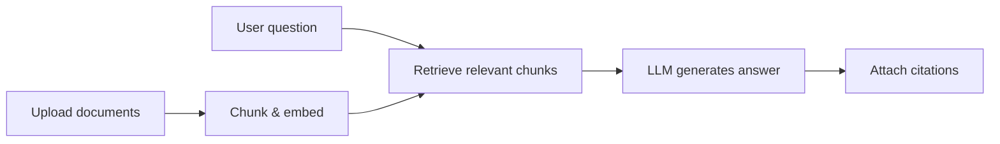

# Knowledge Base & Chat

<div align="center">
  <p><strong>RAG-powered knowledge base Q&A for teams and individuals</strong></p>
  <p>
    <a href="LICENSE">Apache License 2.0</a>
    · <strong>English</strong> | <a href="README.zh-CN.md">简体中文</a>
  </p>
</div>

## Table of contents

- [Overview](#overview)
- [What you can do](#what-you-can-do)
- [Core capabilities](#core-capabilities)
- [For end users](#for-end-users)
- [From question to answer](#from-question-to-answer)
- [Important notes](#important-notes)
- [About this project & upstream](#about-this-project--upstream)
- [Quick start](#quick-start)
- [Local development (pnpm)](#local-development-pnpm)
- [Project structure](#project-structure)
- [Tech stack](#tech-stack)
- [Configuration](#configuration)
- [Deployment & operations](#deployment--operations)
- [License & acknowledgments](#license--acknowledgments)

## Overview

Use your own documents for more reliable Q&A: upload files, ask in natural language, and get answers with traceable references.

## What you can do

A **knowledge base and chat** tool for everyday users and teams. Upload **PDF, Word, Markdown, plain text**, and similar materials, then ask questions in natural language. Answers are grounded in **your uploaded content**, with **citations** when applicable so you can verify the source.

Typical use cases:

| Scenario | Description |
|----------|-------------|
| Document Q&A | Manuals, policies, product docs, notes as a searchable library |
| Reading aid | Ask about long documents and jump to relevant passages |
| Multi-turn chat | Follow-up questions in the same session with context |
| Integrations | Connect your systems via API keys and OpenAPI |

No need to know terms like “vectors” or “RAG”; after deployment, users usually just **open the site, sign in, upload, and ask**.

## Core capabilities

- **Knowledge bases**: Multiple isolated libraries, upload & processing status, retrieval testing
- **Chat**: RAG-backed answers, streaming replies, citation markers with source preview
- **Model settings**: Configure chat and embedding models (cloud providers and local Ollama)
- **i18n UI**: Chinese and English (`/zh`, `/en` routes)
- **API & keys**: OpenAPI retrieval endpoints and API key management
- **Storage**: PostgreSQL + MinIO + ChromaDB / Qdrant (vector store is pluggable)

Screenshots and architecture diagrams: [README.zh-CN.md](README.zh-CN.md) (Chinese).

## For end users

1. **Open the app URL** — provided by your admin or host (intranet or public deployment).
2. **Sign in** — register or use an existing account per your organization.
3. **Create or pick a knowledge base** — e.g. “HR policies”, “product docs”.
4. **Upload documents** — common office and text formats; wait for parsing/indexing before expecting best results.
5. **Start chatting** — ask in plain language; when answers cite sources, **verify against the original documents** for numbers, dates, and compliance-sensitive content.

For login, upload, or answer issues, contact whoever runs your deployment.

## From question to answer



1. Uploaded material is split into searchable segments and stored in the vector database.
2. Each question triggers retrieval of the most relevant segments.
3. A large language model composes the answer and, when possible, points to source locations.

The goal is answers **aligned with your data**, not generic web knowledge.

## Important notes

- **Outputs are indicative**: Models can be wrong or incomplete; verify before legal, medical, or financial decisions.
- **Self-hosting**: Assess security, compliance, and ops before production; test and back up data.
- **Privacy**: Do not upload data you are not allowed to use; retention and cross-border rules depend on your environment.

## About this project & upstream

This repository is a **fork of [rag-web-ui/rag-web-ui](https://github.com/rag-web-ui/rag-web-ui)**, maintained under **Apache License 2.0** with customizations (monorepo layout, PostgreSQL, model configuration UI, etc.). See the upstream repo for generic features.

Thanks to the original authors and community.

## Quick start

### Requirements

| Component | Requirement |
|-----------|-------------|
| Docker | Docker Compose v2.0+ (recommended for full stack) |
| Node.js | 18+ (frontend dev only) |
| pnpm | 8.x (install from repo root) |
| Python | **3.11 or 3.12** (backend; not 3.14 — dependencies incompatible) |
| RAM | 8GB+ recommended |

### Docker Compose (recommended)

```bash
git clone <your-repo-url>
cd rag-web-ui
cp .env.example .env
# Edit .env: CHAT_PROVIDER, EMBEDDINGS_PROVIDER, API keys, etc.
docker compose up -d --build
```

Default URLs (ports per `docker-compose.yml`):

| Service | URL |
|---------|-----|
| Web UI | http://localhost:3000 |
| API | http://localhost:8000 |
| API docs (ReDoc) | http://localhost:8000/redoc |
| MinIO console | http://localhost:9001 |
| Chroma (host mapping) | http://localhost:8001 |

For **Ollama**, install on the host and pull chat + embedding models (e.g. `deepseek-r1:7b`, `bge-m3`). In Compose, `OLLAMA_API_BASE` is often `http://host.docker.internal:11434`; for local dev use `http://localhost:11434`.

## Local development (pnpm)

**pnpm workspace + Turborepo**: Next.js in `apps/web/`, FastAPI in `apps/api/`.

### 1. Install dependencies

From the **repo root** (do not run `npm install` only inside `apps/web`):

```bash
pnpm install
```

### 2. Environment

```bash
cp .env.example .env
```

Dev and prod read **root `.env`**; `apps/api/.env` can override backend vars. Next.js also supports `.env.local` (see `apps/web/next.config.js`).

### 3. Dependency services

When running the API on the host, `apps/api/scripts/dev.sh` maps Compose-style hostnames to localhost:

- `POSTGRES_SERVER=db` → `localhost:5432`
- Use `CHROMA_URL=http://127.0.0.1:28100` locally (avoid bare `localhost` on macOS — IPv6/IPv4 mismatch can cause 502)
- `dev.sh` rewrites `CHROMA_URL` containing `chromadb` / `localhost` to `http://127.0.0.1:28100`
- `MINIO_ENDPOINT=minio:9000` → `localhost:9000`

### 4. Python virtualenv

```bash
cd apps/api
python3.12 -m venv .venv
.venv/bin/pip install -r requirements.txt
cd ../..
```

### 5. Start dev servers

`pnpm dev` starts local Chroma HTTP (`chroma run`, no Docker) and runs frontend + backend. Postgres and MinIO must already be running on your machine.

```bash
pnpm dev
```

Chroma defaults to `http://localhost:28100` (separate from API port 8000). Data dir: `./chroma_data`. API talks to Chroma over HTTP.

| Command | Description |
|---------|-------------|
| `pnpm dev` | Local Chroma HTTP + web + API |
| `pnpm dev:chroma` | Chroma only |
| `pnpm dev:chroma:stop` | Stop Chroma started by `pnpm dev` |
| `pnpm dev:app` | Web + API only (Chroma must be up) |
| `pnpm build` | Production build |
| `pnpm lint` | Lint |
| `pnpm test` / `pnpm test:ci` | Tests |

Web: http://localhost:3000 — API: http://localhost:8000

## Project structure

```
rag-web-ui/
├── apps/
│   ├── api/          # FastAPI, Alembic, services
│   └── web/          # Next.js (i18n, dashboard)
├── docs/images/      # README screenshots
├── docker-compose.yml
├── docker-compose.dev.yml
├── docker-compose.prod.yml
├── Dockerfile.frontend
├── deploy.sh         # prod rsync + compose deploy
├── .env.example
└── package.json      # Turborepo root scripts
```

## Tech stack

| Layer | Stack |
|-------|--------|
| Frontend | Next.js, TypeScript, Tailwind CSS, shadcn/ui |
| Backend | Python FastAPI, LangChain, SQLAlchemy, Alembic |
| Data | PostgreSQL (metadata), ChromaDB / Qdrant (vectors), MinIO (objects) |
| Auth | JWT |
| Tooling | pnpm workspace, Turborepo, Docker |

## Configuration

Copy `.env.example` to `.env` (local) or `.env.production` (`./deploy.sh`). See comments in the file.

### Chat model (`CHAT_PROVIDER`)

| Value | Notes |
|-------|--------|
| `openai` | OpenAI and compatible APIs |
| `deepseek` | DeepSeek |
| `ollama` | Local Ollama |
| `minimax` | MiniMax |
| `anthropic` / `google` / `qwen` / `kimi` / … | OpenAI-compatible (configure key & base URL) |

### Embeddings (`EMBEDDINGS_PROVIDER`)

| Value | Notes |
|-------|--------|
| `openai` | OpenAI embeddings |
| `ollama` | Local models (e.g. `bge-m3`, `nomic-embed-text`) |
| `huggingface` | Set `EMBEDDINGS_MODEL` (see `.env.example`) |
| `dashscope` | Alibaba DashScope |

DeepSeek does **not** provide an embedding API — pair with `ollama`, `openai`, or `huggingface`.

### Vector store (`VECTOR_STORE_TYPE`)

- `chroma` (default): `pnpm dev` runs `chroma run` on the host
- `qdrant`: Uncomment Qdrant in `docker-compose.yml` and set `QDRANT_URL`

More variables: root **`.env.example`**.

## Deployment & operations

| Method | Description |
|--------|-------------|
| `docker-compose.chroma.yml` | Production Chroma HTTP container, data in `./chroma_data` (`deploy.sh` runs `up -d`) |
| `docker compose -f docker-compose.prod.yml` | Production web/API images |
| `./deploy.sh` | rsync + Chroma + build/start + alembic (see `.env.production`) |
| `Dockerfile.frontend` | Frontend image (build context: repo root) |

Production Chroma: `CHROMA_URL=http://host.docker.internal:28100`. Vector data lives in **`chroma_data/`** on the server; `deploy.sh` does not rsync over it.

Before production: rotate **`SECRET_KEY`**, DB and MinIO credentials, and set `API_BASE_URL` / `WEB_BASE_URL` / `CORS_ALLOWED_ORIGINS` (see `.env.example`).

Extended Chinese docs (features, architecture, config tables): [README.zh-CN.md](README.zh-CN.md).

## License & acknowledgments

Licensed under **[Apache License 2.0](LICENSE)**.

Thanks to [rag-web-ui/rag-web-ui](https://github.com/rag-web-ui/rag-web-ui) and the FastAPI, LangChain, Next.js, Chroma, MinIO ecosystems.
