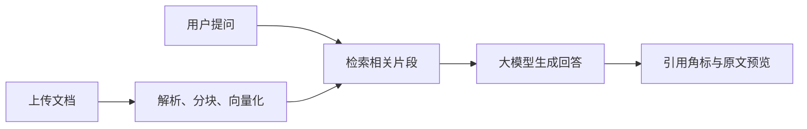
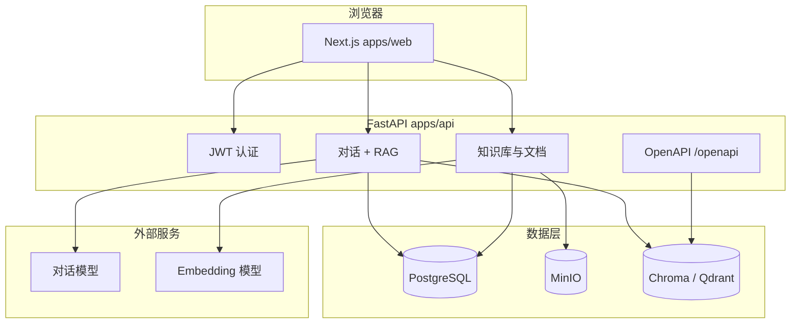

# 智能知识库与对话

<div align="center">
  <p><strong>基于 RAG 的知识库问答 — 上传资料、自然语言提问、回答附带引用出处</strong></p>
  <p>
    <a href="LICENSE">Apache License 2.0</a>
    · <a href="README.md">English</a> | <strong>简体中文</strong>
  </p>
</div>

## 目录

**所有人**

- [产品概览](#产品概览)
- [工作原理](#工作原理)

**终端用户（C 端）**

- [面向终端用户](#面向终端用户)
- [Web 端使用指南](#web-端使用指南)
- [支持的文档格式](#支持的文档格式)
- [使用建议与限制](#使用建议与限制)

**开发者**

- [面向开发者](#面向开发者)
- [系统架构](#系统架构)
- [快速开始（Docker）](#快速开始docker)
- [本地开发](#本地开发)
- [项目结构](#项目结构)
- [配置说明](#配置说明)
- [API 集成](#api-集成)
- [部署与运维](#部署与运维)
- [延伸阅读](#延伸阅读)
- [上游项目与许可证](#上游项目与许可证)
- [界面截图](#界面截图)

---

## 产品概览

| 角色 | 你能获得什么 |
|------|----------------|
| **终端用户** | 网页端上传 PDF/Word/Markdown/文本，针对自己的知识库对话，查看引用与检索过程，无需了解「向量」「RAG」等概念 |
| **开发者** | 可自托管的 monorepo（Next.js + FastAPI），可切换对话/向量模型与向量库，OpenAPI 检索接口，支持 Docker 与 `pnpm dev` |

---

## 工作原理



1. 文档经解析与分块后写入向量库。
2. 每次提问会从所选知识库中检索最相关片段。
3. 对话模型组织回答；界面可展示 **引用序号**、**原文片段** 以及检索进行中的 **状态流**。

---

## 面向终端用户

### 能做什么

- **知识库** — 按主题分库（如人事制度、产品手册）。
- **资料问答** — 用日常语言提问，回答优先依据 **您上传的文件**，而非公开互联网。
- **多轮对话** — 同一会话内连续追问；可为每次对话选择一个或多个知识库。
- **核对出处** — 回答带引用时，可点击角标查看对应文档片段。
- **中英文界面** — 地址栏 `/zh/...` 或 `/en/...`，也可在页头切换语言。

### 典型场景

| 目标 | 操作 |
|------|------|
| 建库 | 控制台 → **知识库** → 新建 → **上传** → 等待处理完成 |
| 测检索 | 进入知识库 → **检索测试** → 不进入对话即可试 query |
| 提问 | **对话** → 新建会话 → 选择知识库 → 输入问题 |
| 对接业务系统 | **API 密钥** → 创建密钥 → 调用 OpenAPI 检索（见 [API 集成](#api-集成)） |

管理员还可在 **模型配置** 中维护对话模型与 Embedding（也可在首次登录前通过服务器 `.env` 配置）。

### Web 端使用指南

部署方提供访问地址后（如 `https://app.example.com` 或 `http://localhost:3000`）：

1. **注册 / 登录** — 账号归属当前部署实例，无公用云租户。
2. **创建知识库** — 命名，可选图标与颜色。
3. **上传文件** — 拖拽或选择文件；状态为 **已完成** 后再提问效果更好。
4. **可选：预览分块** — 上传流程中可预览分块效果（块大小、重叠）。
5. **开始对话** — 选择知识库并提问；可观察检索面板中的进度与命中文档。
6. **重新生成或反馈** — 对助手消息可重新生成，或在支持时提交赞/踩。

**主要功能入口**

| 模块 | 路径（含语言前缀） | 说明 |
|------|-------------------|------|
| 概览 | `/dashboard` | 入口 |
| 知识库 | `/dashboard/knowledge` | 建库、文档列表、上传与处理状态 |
| 对话 | `/dashboard/chat` | RAG 对话、引用、流式输出 |
| RAG 流程 | `/dashboard/rag` | RAG 流程说明/示意 |
| 对话模型 | `/dashboard/llm-configs` | 多厂商对话模型、校验与默认项 |
| 向量模型 | `/dashboard/embedding-configs` | Embedding 配置（换模型后通常需重新入库） |
| API 密钥 | `/dashboard/api-keys` | 程序化检索用的密钥 |

### 支持的文档格式

| 类型 | 扩展名 | 单文件上限（前端） |
|------|--------|-------------------|
| PDF | `.pdf` | 50 MB |
| Word | `.docx` | 50 MB |
| Markdown | `.md` | 50 MB |
| 纯文本 | `.txt` | 50 MB |

扫描版 PDF 若无文字层，解析效果可能较差，建议尽量使用可选中文字的版本。

### 使用建议与限制

- **等待入库完成** — 文档处理显示 **已完成** 后再提问，效果更稳定。
- **核对引用** — 涉及数字、日期、法律/医疗/财务等内容，请以原始文件为准。
- **模型局限** — 大模型仍可能遗漏或编造；检索增强能提高依据性，但不能保证完全正确。
- **隐私合规** — 仅上传有权保存的资料；留存与出境规则取决于贵司部署方式。
- **问题反馈** — 登录、上传、回答质量等问题请联系 **部署方/运维**（除非您自行托管本仓库）。

---

## 面向开发者

本仓库为 **pnpm + Turborepo monorepo**：`apps/web`（Next.js 14、App Router、`next-intl`）与 `apps/api`（FastAPI、LangChain、Alembic）。元数据在 **PostgreSQL**，文件在 **MinIO**，向量在 **Chroma**（默认）或 **Qdrant**。

Fork 自 [rag-web-ui/rag-web-ui](https://github.com/rag-web-ui/rag-web-ui)，主要演进包括 PostgreSQL、统一 `CHAT_*` / `EMBEDDINGS_*` 环境变量、控制台模型配置、对话检索状态流 UI 等。

### 系统架构



### 快速开始（Docker）

**环境：** Docker Compose v2+，建议 8GB+ 内存。

```bash
git clone <your-repo-url>
cd rag-web-ui
cp .env.example .env
# 配置 CHAT_PROVIDER、CHAT_API_KEY、EMBEDDINGS_PROVIDER 等
docker compose up -d --build
```

| 服务 | 默认地址 |
|------|----------|
| 前端 | http://localhost:3000 |
| 后端 API | http://localhost:8000 |
| API 文档（ReDoc） | http://localhost:8000/redoc |
| OpenAPI JSON | http://localhost:8000/api/v1/openapi.json |
| MinIO 控制台 | http://localhost:9001（minioadmin / minioadmin） |
| Chroma（宿主机端口） | http://localhost:8001 |

Compose 内 API 使用 `CHROMA_URL=http://chromadb:8000`。若对话/向量走宿主机 **Ollama**，请将 `CHAT_API_BASE`、`EMBEDDINGS_API_BASE` 设为 `http://host.docker.internal:11434`，并先 `ollama pull` 对应模型（如 `deepseek-r1:7b`、`bge-m3`）。

### 本地开发

**环境要求**

| 工具 | 版本 |
|------|------|
| Node.js | 18+ |
| pnpm | 9.x（见根目录 `packageManager`） |
| Python | **仅 3.11 或 3.12**（3.14 与当前 Pydantic/LangChain 不兼容） |
| Docker | 建议用于 Postgres + MinIO |

**推荐：混合开发** — 有状态服务用 Docker，应用在宿主机：

```bash
cp .env.example .env
# 可保留 POSTGRES_SERVER=db、MINIO_ENDPOINT=minio:9000，dev.sh 会映射到 localhost

docker compose up -d db minio   # Postgres :5432，MinIO :9000 / :9001

pnpm install
cd apps/api && python3.12 -m venv .venv && .venv/bin/pip install -r requirements.txt && cd ../..

pnpm dev   # 本机 Chroma 127.0.0.1:28100 + 前后端 :3000 / :8000
```

`apps/api/scripts/dev.sh` 在宿主机运行时会自动：

- 执行 `alembic upgrade head`
- `POSTGRES_SERVER=db` → `localhost`
- `MINIO_ENDPOINT=minio:9000` → `localhost:9000`
- 将含 `chromadb` / `localhost` 的 `CHROMA_URL` 改为 `http://127.0.0.1:28100`

macOS 上 Chroma 请用 **`127.0.0.1`**，避免 `localhost` 的 IPv6/IPv4 不一致导致 502。

| 命令 | 说明 |
|------|------|
| `pnpm dev` | 本机 Chroma（`./chroma_data`）+ 前后端 |
| `pnpm dev:chroma` | 仅启动 Chroma HTTP |
| `pnpm dev:chroma:stop` | 停止 dev 脚本拉起的 Chroma |
| `pnpm dev:app` | 仅前后端（需 Chroma 已运行） |
| `pnpm build` | 生产构建 |
| `pnpm lint` | 静态检查 |
| `pnpm test` / `pnpm test:ci` | 测试 |
| `pnpm reset-data` | 重置业务数据（破坏性） |
| `pnpm reset-data:dry-run` | 预览重置范围 |

**环境文件**

- 根目录 **`.env`** — API 与文档中的默认项；Compose 与 `pnpm dev` 共用。
- **`apps/api/.env`** — 可选，仅覆盖后端。
- **`apps/web/.env.local`** — 可选，Next.js 覆盖项。

### 项目结构

```
rag-web-ui/
├── apps/
│   ├── api/                 # FastAPI、Alembic、文档流水线、RAG 对话
│   │   ├── app/api/api_v1/  # REST：认证、知识库、对话、模型配置
│   │   ├── app/api/openapi/ # API Key 检索
│   │   └── scripts/         # dev.sh、reset_data.py
│   └── web/                 # Next.js 控制台、对话 UI、i18n（en/zh）
├── docs/                    # 排错、Embedding 指南、教程
├── scripts/                 # dev-chroma.sh、dev-chroma-stop.sh
├── docker-compose.yml       # 完整开发栈
├── docker-compose.prod.yml  # 生产镜像
├── docker-compose.chroma.yml
├── deploy.sh                # rsync + 生产 compose + 迁移
├── .env.example
└── package.json
```

### 配置说明

复制 `.env.example` → `.env`（本地）或 `.env.production`（`./deploy.sh`）。

**对话模型（`CHAT_PROVIDER` + `CHAT_API_*`）**

| 类型 | 说明 |
|------|------|
| `openai`、`deepseek`、`minimax`、`ollama` | 内置适配 |
| `anthropic`、`google`、`qwen`、`kimi`、`mistral`、`azure`、`zhipu` 等 | OpenAI 兼容 Base URL |
| 控制台 | **对话模型** 页面可增删配置（存数据库） |

**向量模型（`EMBEDDINGS_PROVIDER` + `EMBEDDINGS_API_*`）**

| 类型 | 说明 |
|------|------|
| `openai`、`ollama`、`dashscope`、`huggingface` | 见 `.env.example` 中的模型名 |
| 维度变更 | 更换 Embedding 模型后需 **重新处理文档** |

DeepSeek **不提供** Embedding API，请为 `EMBEDDINGS_PROVIDER` 选用 `ollama`、`openai` 或 `huggingface`。

**基础设施**

| 变量 | 用途 |
|------|------|
| `POSTGRES_*` | 用户、知识库、对话、配置等元数据 |
| `MINIO_*` | 原始文件对象存储 |
| `VECTOR_STORE_TYPE` | `chroma`（默认）或 `qdrant` |
| `CHROMA_URL` | 开发：`http://127.0.0.1:28100`；Compose：`http://chromadb:8000`；生产 Docker：`http://host.docker.internal:28100` |
| `SECRET_KEY` | JWT 签名，**生产环境务必更换** |
| `API_BASE_URL`、`WEB_BASE_URL`、`CORS_ALLOWED_ORIGINS` | 生产对外地址 |

旧版分散变量（`OPENAI_API_KEY`、`DEEPSEEK_*` 等）在 `CHAT_*` / `EMBEDDINGS_*` 为空时仍可作为回退。

专题文档：[docs/OLLAMA_EMBEDDINGS.md](docs/OLLAMA_EMBEDDINGS.md)、[docs/HUGGINGFACE_EMBEDDINGS.md](docs/HUGGINGFACE_EMBEDDINGS.md)。

### API 集成

- **浏览器 / 前端** — `POST /api/v1/auth/token` 获取 JWT，访问 `/api/v1/*` 时携带 Bearer。
- **服务端检索** — 在控制台创建 API Key，请求头设置 `X-API-Key: <密钥>`，调用 `/openapi` 下接口（见 ReDoc）。示例：`GET /openapi/{knowledge_base_id}/query?query=...&top_k=3`。
- **Schema** — `http://localhost:8000/api/v1/openapi.json` 与 `/redoc`。

文档入库与对话流式接口在 `/api/v1/` 下，完整路由见 `apps/api/app/api/api_v1/`。

### 部署与运维

| 方式 | 适用场景 |
|------|----------|
| `docker compose up -d --build` | 单机开发/演示全栈 |
| `docker compose -f docker-compose.prod.yml` | 生产前后端容器 |
| `docker compose -f docker-compose.chroma.yml` | 独立 Chroma HTTP（数据 `./chroma_data`，`deploy.sh` 会拉起） |
| `./deploy.sh` | rsync 到 VPS、构建、Alembic；**不包含** 在服务器安装 Postgres/MinIO/Ollama |

生产注意：

- 更换强 `SECRET_KEY`、数据库与 MinIO 密码
- 配置 `API_BASE_URL`、`WEB_BASE_URL`、`CORS_ALLOWED_ORIGINS`
- API 在 Docker、Chroma 在宿主机时：`CHROMA_URL=http://host.docker.internal:28100`
- 定期备份 `chroma_data/`、Postgres、MinIO；`deploy.sh` 不会用 rsync 覆盖服务器上的 `chroma_data`

### 延伸阅读

| 文档 | 内容 |
|------|------|
| [docs/troubleshooting.md](docs/troubleshooting.md) | 数据库、迁移、常见错误 |
| [docs/ADD_DOCUMENT_FLOW.md](docs/ADD_DOCUMENT_FLOW.md) | 上传 → 分块 → 向量化流程 |
| [docs/tutorial/README.md](docs/tutorial/README.md) | RAG 实现教程 |
| [docs/blog/deploy-local.md](docs/blog/deploy-local.md) | 本地部署笔记 |
| [README.md](README.md) | English documentation |

### 上游项目与许可证

在 [rag-web-ui/rag-web-ui](https://github.com/rag-web-ui/rag-web-ui) 基础上维护，遵循 **[Apache License 2.0](LICENSE)**。感谢上游作者及 FastAPI、LangChain、Next.js、Chroma、MinIO 等开源生态。

---

## 界面截图

<div align="center">
  
  <p><em>知识库管理</em></p>

  
  <p><em>文档处理</em></p>

  
  <p><em>文档列表</em></p>

  
  <p><em>带引用序号的对话界面</em></p>

  
  <p><em>API 密钥管理</em></p>

  
  <p><em>API 参考</em></p>
</div>
