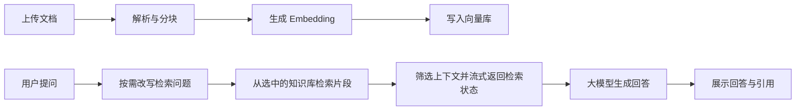
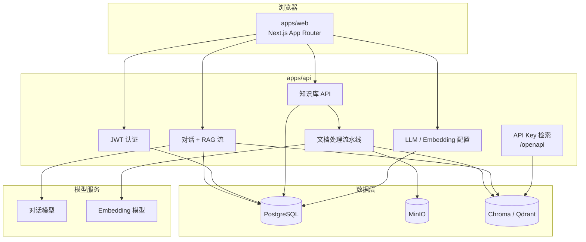

# 智能知识库与对话

<div align="center">
  <p><strong>可自托管的 RAG 知识库问答系统，支持引用、检索进度、可配置模型。</strong></p>
  <p>
    <a href="LICENSE">Apache License 2.0</a>
    · <a href="README.md">English</a> | <strong>简体中文</strong>
  </p>
</div>

## 项目定位

这是一个可自托管的 RAG Web 应用。用户可以创建知识库、上传文档、在对话中提问，并通过引用来源和检索状态核验回答依据。

仓库采用 pnpm + Turborepo monorepo：

- `apps/web`：Next.js App Router 控制台、对话 UI、国际化、模型配置、知识库管理。
- `apps/api`：FastAPI、SQLAlchemy、Alembic、文档入库、向量检索、流式对话。
- PostgreSQL 存储元数据。
- MinIO 存储上传文件。
- Chroma 或 Qdrant 存储向量。
- 对话模型和 Embedding 模型可通过环境变量或控制台配置。

## 产品能力

- 知识库创建、编辑、删除，支持图标和颜色。
- 上传 PDF、DOCX、Markdown、TXT。
- 处理前预览分块。
- 后台文档解析、分块、向量化、失败重试、重新处理。
- 多知识库对话。
- Assistant 回答流式输出。
- 检索状态面板：问题改写、搜索、召回、筛选、生成。
- 引用来源与原文片段预览。
- 用户级 LLM 和 Embedding 配置。
- API Key 支持服务端检索。
- 中英文界面。

## RAG 流程



## 系统架构



## 主要路由

前端路由带语言前缀，例如 `/zh/dashboard/chat` 或 `/en/dashboard/chat`。

| 模块 | 前端路径 |
|---|---|
| 控制台 | `/dashboard` |
| 知识库 | `/dashboard/knowledge` |
| 知识库详情 | `/dashboard/knowledge/:kb_uuid` |
| 对话 | `/dashboard/chat` |
| 对话详情 | `/dashboard/chat/:chat_uuid` |
| RAG 流程 | `/dashboard/rag` |
| 对话模型 | `/dashboard/llm-configs` |
| 向量模型 | `/dashboard/embedding-configs` |
| API 密钥 | `/dashboard/api-keys` |
| 账户 | `/dashboard/account` |

后端主 API 挂载在 `/api`，不是 `/api/v1`。

| 模块 | 后端路径 |
|---|---|
| OpenAPI schema | `/api/openapi.json` |
| 健康检查 | `/api/health` |
| 认证 | `/api/auth/*` |
| 知识库 | `/api/knowledge-base/*` |
| 对话 | `/api/chat/*` |
| 对话模型配置 | `/api/llm-configs/*` |
| 向量模型配置 | `/api/embedding-configs/*` |
| API 密钥 | `/api/api-keys/*` |
| API Key 检索 | `/openapi/knowledge/:kb_uuid/query` |

## Docker 快速开始

环境要求：Docker Compose v2+，建议 8GB+ 内存。

```bash
git clone <your-repo-url>
cd rag-web-ui
cp .env.example .env
# 生产使用前请修改 CHAT_*、EMBEDDINGS_*、SECRET_KEY 等配置。
docker compose up -d --build
```

默认地址：

| 服务 | 地址 |
|---|---|
| Web | http://localhost:3000 |
| API | http://localhost:8000 |
| ReDoc | http://localhost:8000/redoc |
| API schema | http://localhost:8000/api/openapi.json |
| 健康检查 | http://localhost:8000/api/health |
| MinIO 控制台 | http://localhost:9001 |
| Chroma 宿主机端口 | http://localhost:8001 |

Docker Compose 内 API 使用 `CHROMA_URL=http://chromadb:8000`。

如果 Docker 内的 API 访问宿主机 Ollama，请设置：

```env
CHAT_API_BASE=http://host.docker.internal:11434
EMBEDDINGS_API_BASE=http://host.docker.internal:11434
```

## 本地开发

环境要求：

| 工具 | 版本 |
|---|---|
| Node.js | 18+ |
| pnpm | 9.x，见根目录 `package.json` 的 `packageManager` |
| Python | 推荐 3.11 或 3.12 |
| Docker | 推荐用于 PostgreSQL 和 MinIO |

推荐混合开发方式：

```bash
cp .env.example .env

docker compose up -d db minio

pnpm install
cd apps/api
python3.12 -m venv .venv
.venv/bin/pip install -r requirements.txt
cd ../..

pnpm dev
```

`pnpm dev` 会启动本地 Chroma `127.0.0.1:28100`，并通过 Turbo 启动前端和后端。macOS 上建议 Chroma 使用 `127.0.0.1`，不要使用 `localhost`，避免 IPv6/IPv4 不一致问题。

常用命令：

| 命令 | 说明 |
|---|---|
| `pnpm dev` | 启动 Chroma + 前端 + 后端 |
| `pnpm dev:chroma` | 仅启动 Chroma |
| `pnpm dev:chroma:stop` | 停止本地 Chroma |
| `pnpm dev:app` | 仅启动前端 + 后端 |
| `pnpm build` | 构建所有包 |
| `pnpm lint` | 静态检查 |
| `pnpm test` | 按包配置运行测试 |
| `pnpm test:ci` | CI 模式测试 |
| `pnpm reset-data` | 重置业务数据，破坏性操作 |
| `pnpm reset-data:dry-run` | 预览重置范围 |

## 配置

复制 `.env.example` 到 `.env` 用于本地开发，或复制为 `.env.production` 用于部署。

### 对话模型

示例：

```env
CHAT_PROVIDER=deepseek
CHAT_API_KEY=your-api-key
CHAT_API_BASE=https://api.deepseek.com
CHAT_MODEL=deepseek-v4-flash
```

支持模式：

- 内置 provider：`openai`、`deepseek`、`minimax`、`ollama`。
- OpenAI 兼容 provider：`anthropic`、`google`、`qwen`、`kimi`、`mistral`、`azure`、`zhipu` 等，可通过自定义 Base URL 接入。
- 控制台中的模型配置按用户存入 PostgreSQL。

### 向量模型

示例：

```env
EMBEDDINGS_PROVIDER=ollama
EMBEDDINGS_API_BASE=http://localhost:11434
EMBEDDINGS_MODEL=bge-m3
```

支持 provider：

- `openai`
- `ollama`
- `dashscope`
- `huggingface`

更换 Embedding 模型可能改变向量维度，切换后需要重新处理文档。

DeepSeek 不提供 Embedding API。向量模型请使用 `ollama`、`openai`、`dashscope` 或 `huggingface`。

### 检索分数

当向量库返回分数时，后端会把分数流式传给前端。可选过滤配置：

```env
RETRIEVAL_SCORE_THRESHOLD=
RETRIEVAL_SCORE_MODE=distance
```

- `distance`：分数越低越相关。
- `similarity`：分数越高越相关。
- 不配置 threshold 时，仅展示分数，不做过滤。

### 基础设施

| 变量 | 用途 |
|---|---|
| `POSTGRES_*` | 用户、对话、知识库、模型配置、任务等元数据 |
| `MINIO_*` | 上传文档对象存储 |
| `VECTOR_STORE_TYPE` | `chroma` 或 `qdrant` |
| `CHROMA_URL` | Chroma HTTP 地址 |
| `QDRANT_URL` | Qdrant 地址 |
| `SECRET_KEY` | JWT 签名密钥，生产环境必须更换 |
| `WEB_BASE_URL` | 前端公开地址 |
| `API_BASE_URL` | 前端访问的 API 公开地址 |
| `CORS_ALLOWED_ORIGINS` | 额外允许的跨域来源 |

旧版 provider 变量如 `OPENAI_API_KEY`、`DEEPSEEK_*`、`OLLAMA_*` 仍可作为回退；当统一的 `CHAT_*` / `EMBEDDINGS_*` 为空时生效。

## API 集成

### 浏览器 / SPA

使用 JWT 认证：

```text
POST /api/auth/token
Authorization: Bearer <token>
```

主应用 API 均在 `/api/*` 下。

### 服务端检索

在控制台创建 API Key 后调用：

```text
GET /openapi/knowledge/:kb_uuid/query?query=...&top_k=3
X-API-Key: <your-api-key>
```

响应示例：

```json
{
  "results": [
    {
      "content": "...",
      "metadata": {
        "file_name": "example.pdf",
        "kb_uuid": "01...",
        "document_id": 123
      },
      "score": 0.123
    }
  ]
}
```

## 项目结构

```text
rag-web-ui/
├── apps/
│   ├── api/
│   │   ├── app/api/api_v1/      # 认证、知识库、对话、模型配置、API Key
│   │   ├── app/api/openapi/     # API Key 检索
│   │   ├── app/models/          # SQLAlchemy 模型
│   │   ├── app/services/        # RAG、文档处理、模型 provider
│   │   └── alembic/             # 数据库迁移
│   └── web/
│       ├── src/app/             # Next.js 路由
│       ├── src/components/      # UI 组件
│       ├── src/lib/             # 客户端工具和流解析
│       └── src/messages/        # 中英文文案
├── docs/
├── scripts/
├── docker-compose.yml
├── docker-compose.prod.yml
├── docker-compose.chroma.yml
├── pnpm-workspace.yaml
└── package.json
```

## 部署说明

可选方式：

| 方式 | 场景 |
|---|---|
| `docker compose up -d --build` | 单机演示/开发 |
| `docker compose -f docker-compose.prod.yml up -d --build` | 生产前后端容器 |
| `docker compose -f docker-compose.chroma.yml up -d` | 独立 Chroma 进程 |
| `./deploy.sh` | rsync 到 VPS、启动生产 Compose、执行迁移 |

生产检查项：

- 设置强 `SECRET_KEY`。
- 设置真实 PostgreSQL 和 MinIO 凭证。
- 配置 `WEB_BASE_URL`、`API_BASE_URL`、`CORS_ALLOWED_ORIGINS`。
- 备份 PostgreSQL、MinIO 数据和 `chroma_data/`。
- 不要依赖本地 `/tmp` 文件持久化；处理完成后的文档应以 MinIO 为准。

## 延伸阅读

| 文件 | 内容 |
|---|---|
| [docs/ADD_DOCUMENT_FLOW.md](docs/ADD_DOCUMENT_FLOW.md) | 文档上传、分块、向量化 |
| [docs/OLLAMA_EMBEDDINGS.md](docs/OLLAMA_EMBEDDINGS.md) | Ollama 向量模型配置 |
| [docs/HUGGINGFACE_EMBEDDINGS.md](docs/HUGGINGFACE_EMBEDDINGS.md) | HuggingFace 向量模型配置 |
| [docs/troubleshooting.md](docs/troubleshooting.md) | 常见问题排查 |
| [docs/tutorial/README.md](docs/tutorial/README.md) | 中文 RAG 教程 |

## 许可证

本项目基于 [rag-web-ui/rag-web-ui](https://github.com/rag-web-ui/rag-web-ui) 维护，遵循 [Apache License 2.0](LICENSE)。
