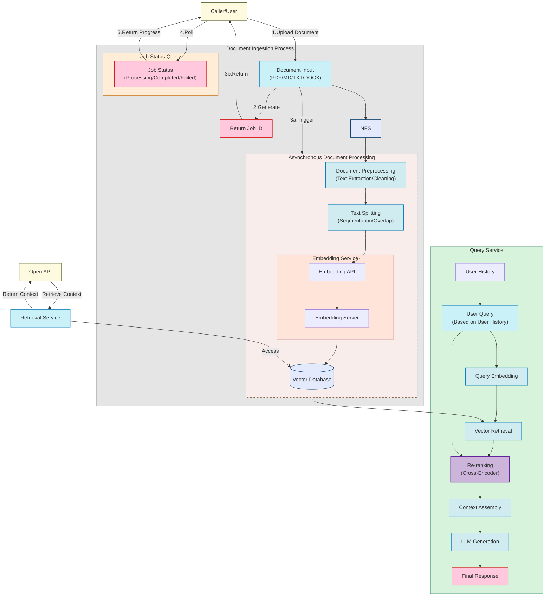

<div align="center">
  
  <br />
  <p>
    <strong>基于 RAG (Retrieval-Augmented Generation) 的知识库管理</strong>
  </p>

  <p>
    <a href="https://github.com/rag-web-ui/rag-web-ui/blob/main/LICENSE"></a>
    <a href="#"></a>
    <a href="#"></a>
    <a href="#"></a>
  </p>

  <p>
    <a href="#特性">特性</a> •
    <a href="#快速开始">快速开始</a> •
    <a href="#部署指南">部署指南</a> •
    <a href="#技术架构">技术架构</a> •
    <a href="#开发指南">开发指南</a> •
    <a href="#贡献指南">贡献指南</a>
  </p>

  <h4>
    <a href="README.md">English</a> |
    <span>简体中文</span>
  </h4>
</div>

## 📖 简介

RAG Web UI 是一个基于 RAG (Retrieval-Augmented Generation) 技术的智能对话系统，它能够帮助构建基于自有知识库的智能问答系统。通过结合文档检索和大语言模型，实现了准确、可靠的知识问答服务。

系统支持多种大语言模型部署方式，既可以使用 OpenAI、DeepSeek 等云端服务，也支持通过 Ollama 部署本地模型，满足不同场景下的隐私和成本需求。

同时提供 OpenAPI 接口，方便用户通过 API 调用知识库。

你可以通过[RAG 教程](./docs/tutorial/README.md)来了解整个项目的实现流程。

## ✨ 特性
- 📚 **智能文档管理**
  - 支持多种文档格式 (PDF、DOCX、Markdown、Text)
  - 文档自动分块和向量化
  - 支持异步文档、增量处理

- 🤖 **先进的对话引擎**
  - 基于 RAG 的精准检索和生成
  - 支持上下文多轮对话
  - 支持对话中引用角标查看原文

- 🎯 **合理架构**
  - 前后端分离设计
  - 分布式文件存储
  - 高性能向量数据库: 支持 ChromaDB、Qdrant，通过 Factory 模式，可以方便的切换向量数据库

## 🖼️ 截图

<div align="center">
  
  <p><em>知识库管理 Dashboard</em></p>
  
  
  <p><em>文档处理 Dashboard</em></p>
  
  
  <p><em>文档列表</em></p>
  
  
  <p><em>带引用序号的智能对话界面</em></p>
  
  
  <p><em>API Key 管理</em></p>

  
  <p><em>API 参考</em></p>
</div>

 
## 项目流程图



## 🚀 快速开始

### 环境要求

- Docker & Docker Compose v2.0+
- Node.js 18+
- Python 3.9+
- 8GB+ RAM

### 安装步骤

1. 克隆项目
```bash
git clone https://github.com/rag-web-ui/rag-web-ui.git
cd rag-web-ui
```
2. 配置环境变量

注意配置文件中的环境，详细配置往下看配置表格～

```bash
cp .env.example .env
```

3. 启动服务(开发环境的配置)
```bash
docker compose up -d --build
```

### 验证安装

服务启动后，可以通过以下地址访问：

- 🌐 前端界面: http://127.0.0.1.nip.io
- 📚 API 文档: http://127.0.0.1.nip.io/redoc
- 💾 MinIO 控制台: http://127.0.0.1.nip.io:9001

## 🏗️ 技术架构

### 后端技术栈

- 🐍 **Python FastAPI**: 高性能异步 Web 框架
- 🗄️ **MySQL + ChromaDB**: 关系型数据库 + 向量数据库
- 📦 **MinIO**: 对象存储
- 🔗 **Langchain**: LLM 应用开发框架
- 🔒 **JWT + OAuth2**: 身份认证

### 前端技术栈

- ⚛️ **Next.js 14**: React 应用框架
- 📘 **TypeScript**: 类型安全
- 🎨 **Tailwind CSS**: 原子化 CSS
- 🎯 **Shadcn/UI**: 高质量组件库
- 🤖 **Vercel AI SDK**: AI 功能集成

## 📈 性能优化

系统在以下方面进行了性能优化：

- ⚡️ 文档增量处理和异步分块
- 🔄 流式响应和实时反馈
- 📑 向量数据库性能调优
- 🎯 分布式任务处理

## 📖 开发指南

使用 docker compose 启动开发环境，可热更新
```bash
docker compose -f docker-compose.dev.yml up -d --build
```

访问地址：http://127.0.0.1.nip.io

## 🔧 配置说明

### 核心配置项

| 配置项                      | 说明                     | 默认值    | 必填 |
| --------------------------- | ------------------------ | --------- | ---- |
| MYSQL_SERVER                | MySQL 服务器地址         | localhost | ✅    |
| MYSQL_USER                  | MySQL 用户名             | postgres  | ✅    |
| MYSQL_PASSWORD              | MySQL 密码               | postgres  | ✅    |
| MYSQL_DATABASE              | MySQL 数据库名           | ragwebui  | ✅    |
| SECRET_KEY                  | JWT 加密密钥             | -         | ✅    |
| ACCESS_TOKEN_EXPIRE_MINUTES | JWT token 过期时间(分钟) | 30        | ✅    |

### LLM 配置

| 配置项            | 说明                  | 默认值                    | 适用场景                               |
| ----------------- | --------------------- | ------------------------- | -------------------------------------- |
| CHAT_PROVIDER     | LLM 服务提供商        | openai                    | ✅                                      |
| OPENAI_API_KEY    | OpenAI API 密钥       | -                         | 使用 OpenAI 时必填                     |
| OPENAI_API_BASE   | OpenAI API 基础 URL   | https://api.openai.com/v1 | 使用 OpenAI 时可选                     |
| OPENAI_MODEL      | OpenAI 模型名称       | gpt-4                     | 使用 OpenAI 时必填                     |
| DEEPSEEK_API_KEY  | DeepSeek API 密钥     | -                         | 使用 DeepSeek 时必填                   |
| DEEPSEEK_API_BASE | DeepSeek API 基础 URL | -                         | 使用 DeepSeek 时必填                   |
| DEEPSEEK_MODEL    | DeepSeek 模型名称     | -                         | 使用 DeepSeek 时必填                   |
| OLLAMA_API_BASE   | Ollama API 基础 URL   | http://localhost:11434    | 使用 Ollama 时必填, 注意需要先拉取模型 |
| OLLAMA_MODEL      | Ollama 模型名称       | -                         | 使用 Ollama 时必填                     |

### Embedding 配置

| 配置项                      | 说明                     | 默认值                 | 适用场景                     |
| --------------------------- | ------------------------ | ---------------------- | ---------------------------- |
| EMBEDDINGS_PROVIDER         | Embedding 服务提供商     | openai                 | ✅                            |
| OPENAI_API_KEY              | OpenAI API 密钥          | -                      | 使用 OpenAI Embedding 时必填 |
| OPENAI_EMBEDDINGS_MODEL     | OpenAI Embedding 模型    | text-embedding-ada-002 | 使用 OpenAI Embedding 时必填 |
| DASH_SCOPE_API_KEY          | DashScope API 密钥       | -                      | 使用 DashScope 时必填        |
| DASH_SCOPE_EMBEDDINGS_MODEL | DashScope Embedding 模型 | -                      | 使用 DashScope 时必填        |
| OLLAMA_EMBEDDINGS_MODEL     | Ollama Embedding 模型（`bge-m3` 或 `nomic-embed-text`） | bge-m3 | 使用 Ollama Embedding 时必填 |

### 向量数据库配置

| 配置项             | 说明                      | 默认值                | 适用场景             |
| ------------------ | ------------------------- | --------------------- | -------------------- |
| VECTOR_STORE_TYPE  | 向量存储类型              | chroma                | ✅                    |
| CHROMA_DB_HOST     | ChromaDB 服务器地址       | localhost             | 使用 ChromaDB 时必填 |
| CHROMA_DB_PORT     | ChromaDB 端口             | 8000                  | 使用 ChromaDB 时必填 |
| QDRANT_URL         | Qdrant 向量存储 URL       | http://localhost:6333 | 使用 Qdrant 时必填   |
| QDRANT_PREFER_GRPC | Qdrant 优先使用 gRPC 连接 | true                  | 使用 Qdrant 时可选   |

### 对象存储配置

| 配置项            | 说明             | 默认值         | 必填 |
| ----------------- | ---------------- | -------------- | ---- |
| MINIO_ENDPOINT    | MinIO 服务器地址 | localhost:9000 | ✅    |
| MINIO_ACCESS_KEY  | MinIO 访问密钥   | minioadmin     | ✅    |
| MINIO_SECRET_KEY  | MinIO 密钥       | minioadmin     | ✅    |
| MINIO_BUCKET_NAME | MinIO 存储桶名称 | documents      | ✅    |

### 其他配置

| 配置项 | 说明     | 默认值        | 必填 |
| ------ | -------- | ------------- | ---- |
| TZ     | 时区设置 | Asia/Shanghai | ❌    |

## 🤝 贡献指南

我们非常欢迎社区贡献！

### 贡献流程

1. Fork 本仓库
2. 创建特性分支 (`git checkout -b feature/AmazingFeature`)
3. 提交改动 (`git commit -m 'Add some AmazingFeature'`)
4. 推送到分支 (`git push origin feature/AmazingFeature`)
5. 创建 Pull Request

### 开发规范

- 遵循 [Python PEP 8](https://pep8.org/) 代码规范
- 遵循 [Conventional Commits](https://www.conventionalcommits.org/) 提交规范

### 🚧 Roadmap

- [x] 知识库 API 集成
- [ ] 自然语言工作流
- [ ] 多路召回
- [x] 支持多模型
- [x] 支持多向量数据库
- [x] 支持本地模型

## 补充

本项目仅用于学习交流 RAG ，请勿用于商业用途，不具备在生产环境使用的条件，还在持续开发中。

## 🔧 常见问题

为了方便大家使用，我们整理了常见问题和解决方案，请参考[Troubleshooting Guide](docs/troubleshooting.md)。

## 📄 许可证

本项目采用 [Apache-2.0 许可证](LICENSE)

## 🙏 致谢

感谢以下开源项目：

- [FastAPI](https://fastapi.tiangolo.com/)
- [Langchain](https://python.langchain.com/)
- [Next.js](https://nextjs.org/)
- [ChromaDB](https://www.trychroma.com/)


---

<div align="center">
  如果这个项目对你有帮助，请考虑给它一个 ⭐️
</div> 
