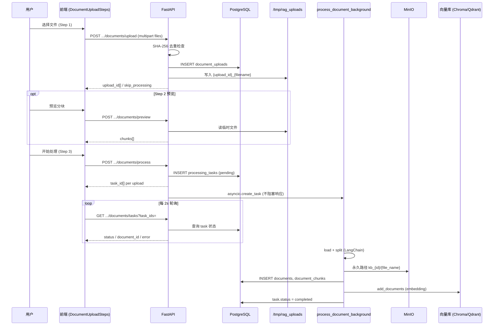

# 添加文档（Add Document）前后端流程

本文说明知识库「添加文档」从用户操作到向量入库的完整链路，涵盖入口页面、API、数据表与后台处理。

## 概览

添加文档分为 **三个阶段**：

| 阶段 | 用户动作 | 后端 API | 持久化 |
|------|----------|----------|--------|
| 1. 上传 | 选择/拖入文件并提交 | `POST /api/knowledge-base/{kb_id}/documents/upload` | `document_uploads` + 本地临时文件 |
| 2. 预览（可选） | 调整分块参数并预览 | `POST /api/knowledge-base/{kb_id}/documents/preview` | 无（仅内存计算） |
| 3. 处理 | 确认入库 | `POST /api/knowledge-base/{kb_id}/documents/process` | `processing_tasks` → 后台任务 → `documents` + `document_chunks` + 向量库 + MinIO |

处理为 **异步**：前端轮询 `GET /api/knowledge-base/{kb_id}/documents/tasks` 直到 `completed` 或 `failed`。



## 前端入口

### 主路径（推荐）：知识库详情弹窗

- **页面**：`apps/web/src/app/[locale]/dashboard/knowledge/[id]/page.tsx`
- **组件**：`apps/web/src/components/knowledge-base/document-upload-steps.tsx`
- **触发**：点击「添加文档」打开 Dialog，内嵌三步 Stepper。

三步对应关系：

| Step | UI | 调用的 API |
|------|-----|------------|
| 1 上传 | Dropzone +「上传文件」 | `documents/upload`（批量，`FormData` 字段名 `files`） |
| 2 预览 | 选文件、chunk_size/overlap、「预览分块」 | `documents/preview` |
| 3 处理 | 「处理」按钮 + 进度条 | `documents/process` + 轮询 `documents/tasks` |

上传完成后 `onComplete` 会刷新 `DocumentList`（`refreshKey` 递增）。

### 备用路径：独立上传页

- **页面**：`apps/web/src/app/[locale]/dashboard/knowledge/[id]/upload/page.tsx`
- **流程**：拖入即单文件上传 → 手动「Start Processing」→ 轮询任务。
- **注意**：该页 `FormData` 使用字段名 `file`，而后端期望 **`files`（列表）**。主流程请使用 `DocumentUploadSteps`；若仍维护 upload 页，应将字段改为 `files` 并与批量接口对齐。

### HTTP 客户端

- **库**：`apps/web/src/lib/api.ts`
- **基址**：`getApiBase()`（`NEXT_PUBLIC_API_BASE_URL` 或 `hostname:8000`）
- **鉴权**：`Authorization: Bearer <token>`（localStorage）
- **上传**：`FormData` 时不设置 `Content-Type`，由浏览器带 `multipart boundary`

## 后端 API

路由前缀：`/api/knowledge-base`（见 `apps/api/app/api/api_v1/api.py`）。

所有接口需登录：`Depends(get_current_user)`，且校验 `KnowledgeBase.user_id == current_user.id`。

### 1. `POST /{kb_id}/documents/upload`

**实现**：`apps/api/app/api/api_v1/knowledge_base.py` → `upload_kb_documents`

**请求**：`multipart/form-data`，字段 **`files`**（可多个 `UploadFile`）。

**逻辑**：

1. 读取文件内容，计算 **SHA-256** `file_hash`。
2. 若同 KB 下已存在相同 `file_name` + `file_hash` 的 `Document`：
   - 返回 `status: "exists"`, `skip_processing: true`, `document_id`（前端标记为已完成，跳过处理）。
3. 否则：
   - 插入 `DocumentUpload`（`temp_path` 先空）。
   - 写入本地 **`/tmp/rag_uploads/{upload_id}_{filename}`**。
   - 更新 `upload.temp_path`。
   - 返回 `upload_id`, `file_name`, `status: "pending"`, `skip_processing: false`。

**响应**：`UploadResult[]`（数组，每个文件一项）。

### 2. `POST /{kb_id}/documents/preview`

**请求体**（`PreviewRequest`，`apps/api/app/schemas/knowledge.py`）：

```json
{
  "document_ids": [123],
  "chunk_size": 1000,
  "chunk_overlap": 200
}
```

`document_ids` 可为：

- 已入库的 **`Document.id`**，或
- 上传阶段的 **`DocumentUpload.id`**（前端 Step 2 传的是 `uploadId`）。

**实现**：`preview_document()`（`apps/api/app/services/document_processor.py`）

- 本地路径存在则直接读；否则从 MinIO 拉临时文件。
- 按扩展名选择 Loader：PDF / DOCX / MD / TXT。
- `RecursiveCharacterTextSplitter` 分块后返回 `chunks` + `total_chunks`（不写库）。

### 3. `POST /{kb_id}/documents/process`

**请求体**：`List[dict]`，每项示例：

```json
{
  "upload_id": 1,
  "file_name": "manual.pdf",
  "skip_processing": false
}
```

**逻辑**：

1. 过滤 `skip_processing: true` 的项。
2. 校验 `upload_id` 属于该 KB。
3. 为每个 upload 创建 **`ProcessingTask`**（`status: pending`）。
4. 通过 FastAPI **`BackgroundTasks`** 调用 `add_processing_tasks_to_queue`，内部对每个任务 **`asyncio.create_task(process_document_background(...))`**。
5. 立即返回 `{ "tasks": [{ "upload_id", "task_id" }, ...] }`。

### 4. `GET /{kb_id}/documents/tasks?task_ids=1,2,3`

**响应**：以 **task_id 为 key** 的字典，例如：

```json
{
  "42": {
    "document_id": 10,
    "status": "completed",
    "error_message": null,
    "upload_id": 1,
    "file_name": "manual.pdf"
  }
}
```

`status` 取值：`pending` | `processing` | `completed` | `failed`。

## 后台处理：`process_document_background`

**文件**：`apps/api/app/services/document_processor.py`

在独立 DB Session 中执行（API 请求返回后仍在后台运行）：

| 步骤 | 说明 |
|------|------|
| 1 | `ProcessingTask.status = processing` |
| 2 | 从 `temp_path` 读本地文件（或兼容旧数据从 MinIO 下载） |
| 3 | LangChain Loader + TextSplitter 分块 |
| 4 | `EmbeddingsFactory` + `VectorStoreFactory`（collection `kb_{kb_id}`） |
| 5 | 上传到 MinIO 永久路径 **`kb_{kb_id}/{file_name}`** |
| 6 | 插入 **`Document`**（`file_path` 等为 MinIO 路径） |
| 7 | 批量插入 **`DocumentChunk`**（含 content hash） |
| 8 | `vector_store.add_documents(chunks)` |
| 9 | `task.status = completed`, `task.document_id = document.id` |
| 失败 | `task.status = failed`, `error_message` 写入 |

## 数据模型

定义于 `apps/api/app/models/knowledge.py`：

| 表 | 作用 |
|----|------|
| `knowledge_bases` | 知识库归属 `user_id` |
| `document_uploads` | 上传会话：临时路径、hash、size、status |
| `processing_tasks` | 异步任务状态，关联 `document_upload_id`，完成后填 `document_id` |
| `documents` | 正式文档元数据；`(knowledge_base_id, file_name)` 唯一 |
| `document_chunks` | 分块元数据与 hash，供增量更新等 |

删除知识库时会级联清理 documents、uploads、tasks、chunks；向量库与 MinIO 对象在 `delete_knowledge_base` 中另行清理（见 `knowledge_base.py` 删除逻辑）。

## 支持的文件类型

前后端一致接受：

- `.pdf` — `PyPDFLoader`
- `.docx` — `Docx2txtLoader`
- `.md` — `UnstructuredMarkdownLoader`
- `.txt` — `TextLoader`

`DocumentUploadSteps` 额外限制单文件 **50MB**（`maxSize`）；upload 页未设上限。

## 去重与幂等

- **上传阶段**：相同文件名 + 相同内容 hash → 直接返回已有 `document_id`，`skip_processing: true`。
- **处理阶段**：`skip_processing: true` 的 upload 不会创建 `ProcessingTask`。
- 同名不同内容：受 `uq_kb_file_name` 约束，需先删旧文档或改名（业务层未自动覆盖）。

## 相关文件索引

| 层级 | 路径 |
|------|------|
| 前端 UI | `apps/web/src/components/knowledge-base/document-upload-steps.tsx` |
| 前端入口 | `apps/web/src/app/[locale]/dashboard/knowledge/[id]/page.tsx` |
| 前端列表 | `apps/web/src/components/knowledge-base/document-list.tsx` |
| API 路由 | `apps/api/app/api/api_v1/knowledge_base.py` |
| 文档处理 | `apps/api/app/services/document_processor.py` |
| Schema | `apps/api/app/schemas/knowledge.py` |
| 模型 | `apps/api/app/models/knowledge.py` |

## 运维与排错

- **临时文件**：默认 `/tmp/rag_uploads`；`POST /api/knowledge-base/cleanup` 可清理超过 24 小时的 `document_uploads`（注意 cleanup 里对 MinIO 的删除逻辑与当前「本地 temp_path」存储方式可能不一致，排错时以实际 `temp_path` 为准）。
- **向量库 collection**：`kb_{knowledge_base_id}`，需与 `VECTOR_STORE_TYPE`、Embedding 配置一致。
- **轮询失败**：`DocumentUploadSteps` 对 status 接口有最多 3 次重试；持续 `processing` 时查 API 日志与 `processing_tasks.error_message`。
- **401**：token 失效会跳转登录（`api.ts`）。

## 与 RAG 对话的关系

文档入库后，对话接口（`chat_service`）按 `knowledge_base_ids` 加载 `Document`，在对应 `kb_{id}` 向量 collection 中检索，再生成带引用的回答。添加文档流程 **不直接调用 LLM**，仅负责 ingestion；问答在 Chat 模块完成。
